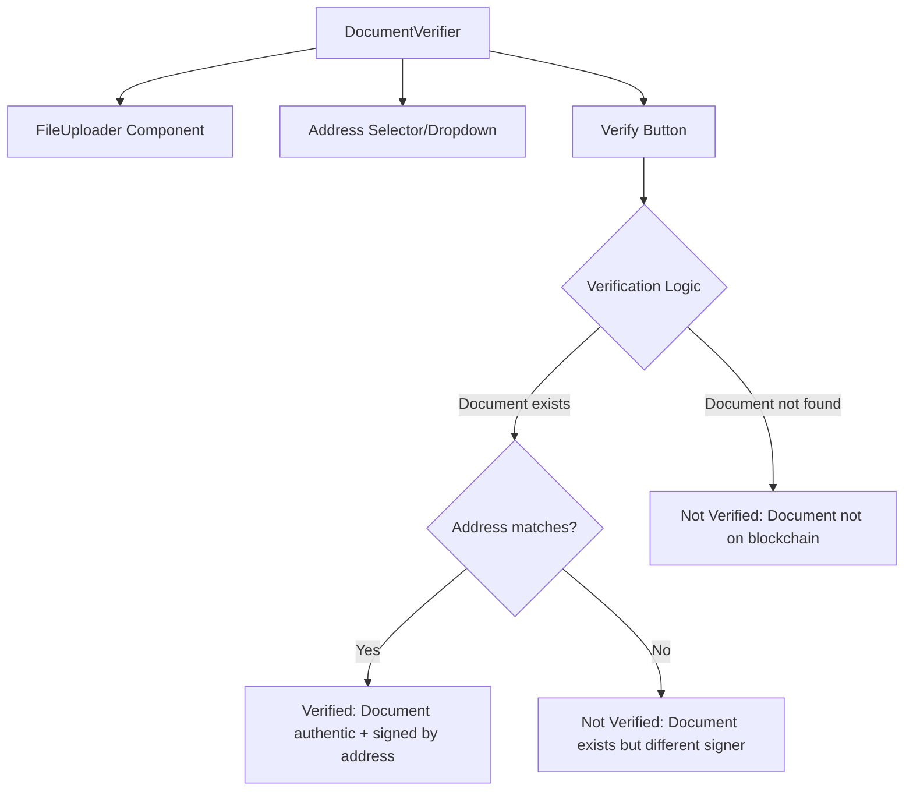
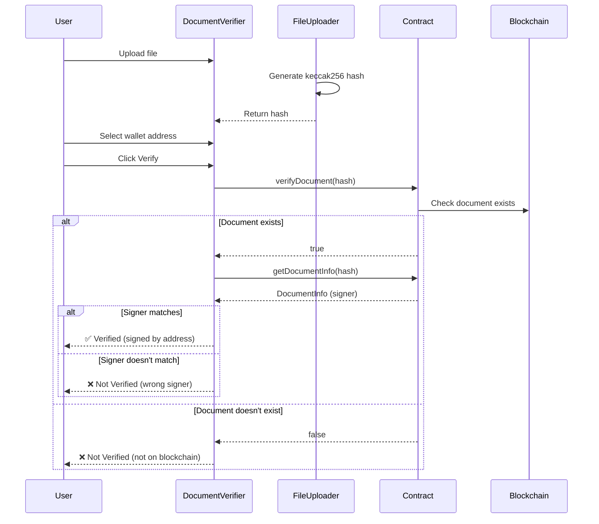

# Plan: Improve Verify Document Tab

## Objective

Replace the Document Hash input field in the Verify Document tab with a more user-friendly interface that:
1. Uses a file uploader to generate the hash automatically (instead of manual hash input)
2. Adds an address input field with clipboard copy functionality for Anvil wallet addresses
3. Verifies if the document was signed by a specific wallet address
4. Provides clear verification status with reasons when inputs don't match

---

## Current State Analysis

### Existing Components

| Component | File | Purpose |
|-----------|------|---------|
| DocumentVerifier | [`dapp/components/DocumentVerifier.tsx`](dapp/components/DocumentVerifier.tsx:1) | Currently has text input for hash, verifies document on blockchain |
| FileUploader | [`dapp/components/FileUploader.tsx`](dapp/components/FileUploader.tsx:1) | Generates keccak256 hash from uploaded file |
| WalletContext | [`dapp/contexts/WalletContext.tsx`](dapp/contexts/WalletContext.tsx:1) | Provides 10 derived Anvil wallets |
| useContract | [`dapp/hooks/useContract.ts`](dapp/hooks/useContract.ts:1) | Contains `verifyDocument()` and `getDocumentInfo()` functions |

### Current Verification Flow

```
User enters hash → verifyDocument(hash) → returns boolean → getDocumentInfo() for details
```

---

## Proposed Changes

### 1. Modify DocumentVerifier Component

**New UI Structure:**



**UI Components:**

1. **File Uploader** - Reuses existing [`FileUploader.tsx`](dapp/components/FileUploader.tsx:1) component
   - User uploads a file → hash is auto-generated via keccak256
   - Eliminates need for manual hash input

2. **Address Selector** - New dropdown component
   - Lists all 10 Anvil wallet addresses (from [`WalletContext.tsx`](dapp/contexts/WalletContext.tsx:28))
   - Each address has a "Copy to Clipboard" button
   - Optional: Can be empty (wildcard - any signer)

3. **Verification Results** - Enhanced status display

| Status | Condition | Message |
|--------|-----------|---------|
| ✅ Verified | Document on blockchain AND signer matches | "Document is authentic and was signed by [address]" |
| ❌ Not Verified | Document not on blockchain | "Document not found on blockchain" |
| ❌ Not Verified | Document exists but different signer | "Document exists but was signed by [actual signer], not [expected address]" |
| ⚠️ Error | No file uploaded | "Please upload a document to verify" |

---

### 2. Update useContract Hook (Optional Enhancement)

Add new verification function to check address-specific verification:

```typescript
// New function in useContract.ts
const verifyDocumentWithAddress = useCallback(async (
  documentHash: string, 
  expectedSigner: string
): Promise<{isValid: boolean, reason: string}> => {
  const info = await getDocumentInfo(documentHash);
  
  if (!info) {
    return { isValid: false, reason: 'Document not found on blockchain' };
  }
  
  if (info.signer.toLowerCase() === expectedSigner.toLowerCase()) {
    return { isValid: true, reason: 'Document verified successfully' };
  }
  
  return { 
    isValid: false, 
    reason: `Document exists but was signed by ${info.signer}, not ${expectedSigner}` 
  };
}, [getDocumentInfo]);
```

---

### 3. Component Integration

**Modified Files:**

| File | Changes |
|------|---------|
| [`dapp/components/DocumentVerifier.tsx`](dapp/components/DocumentVerifier.tsx:1) | Replace hash input with FileUploader + Address selector |
| [`dapp/hooks/useContract.ts`](dapp/hooks/useContract.ts:1) | Add `verifyDocumentWithAddress` function (optional) |
| [`dapp/app/page.tsx`](dapp/app/page.tsx:1) | Pass wallets to DocumentVerifier (if needed) |

---

## Implementation Steps

### Step 1: Enhance DocumentVerifier Component

- [ ] Import `FileUploader` component
- [ ] Import `useWallet` hook for wallet addresses
- [ ] Add state for: `selectedFile`, `generatedHash`, `selectedAddress`
- [ ] Replace hash text input with FileUploader
- [ ] Create address selector dropdown with copy-to-clipboard buttons
- [ ] Implement verification logic with address checking
- [ ] Update result display to show verification reasons

### Step 2: Add Address Selector Component

- [ ] Create address dropdown showing all 10 Anvil wallets
- [ ] Add clipboard copy functionality for each address
- [ ] Include option for "Any Address" (wildcard search)

### Step 3: Update Verification Logic

- [ ] Check if document exists on blockchain
- [ ] If exists, compare signer address with selected address
- [ ] Return appropriate verification status with reason

### Step 4: Test and Verify

- [ ] Test file upload generates correct hash
- [ ] Test address selection and clipboard copy
- [ ] Test verification with matching signer
- [ ] Test verification with non-matching signer
- [ ] Test verification with non-existent document

---

## Data Flow



---

## Acceptance Criteria

1. **File Upload Works**: User can upload any file and hash is automatically generated
2. **Address Selection**: User can select from 10 Anvil wallet addresses
3. **Clipboard Copy**: Each address has a working copy-to-clipboard button
4. **Verification Results**:
   - Document found + signer matches → ✅ Verified
   - Document found + signer doesn't match → ❌ Not Verified (shows reason)
   - Document not found → ❌ Not Verified (shows "not on blockchain")
5. **No Manual Hash Entry**: User never needs to handle raw hash strings

---

## Environment Details

- **RPC URL**: `http://localhost:8545` (from [`dapp/lib/contract.ts`](dapp/lib/contract.ts:19))
- **Chain ID**: 31337 (Anvil)
- **Mnemonic**: Anvil default (`test test test test test test test test test test test junk`)
- **Wallet Count**: 10 derived wallets
- **Contract ABI**: [`dapp/lib/contract.ts`](dapp/lib/contract.ts:4)
