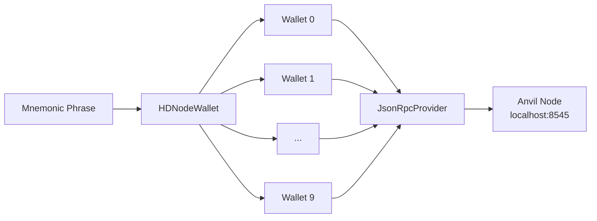
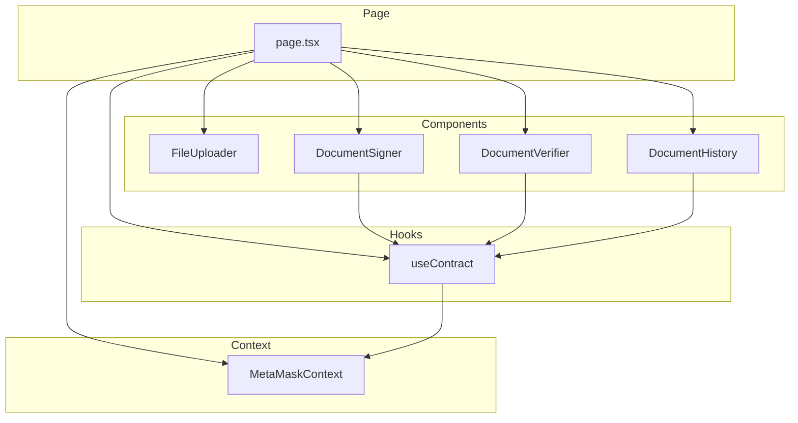
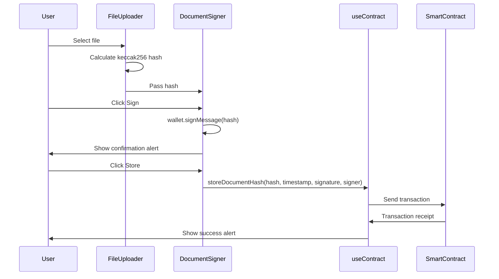

# ETH Database Document - Implementation Plan

## Project Overview

Build a **decentralized application (dApp)** for storing and verifying document authenticity using Ethereum blockchain. This project teaches fundamental Web3 development concepts through hands-on implementation.

---

## Learning Objectives

By completing this project, you will learn:

1. **Smart Contract Development** with Solidity and Foundry
2. **Gas Optimization** techniques for efficient storage
3. **Frontend Web3 Integration** with Next.js and Ethers.js v6
4. **Digital Signatures** using ECDSA cryptography
5. **Local Blockchain Development** with Anvil
6. **React Context API** for state management
7. **TypeScript** best practices in Web3 applications

---

## Project Structure

```
document_signer/
├── plans/                          # Documentation and plans
│   ├── TAREA PARA ESTUDIANTE.md    # Original requirements (Spanish)
│   └── implementation_plan.md      # This file
├── sc/                             # Smart Contracts (Foundry project)
│   ├── src/
│   │   └── DocumentRegistry.sol    # Main contract
│   ├── test/
│   │   └── DocumentRegistry.t.sol  # Contract tests
│   ├── script/
│   │   └── Deploy.s.sol            # Deployment script
│   ├── lib/                        # Dependencies (forge-std)
│   ├── out/                        # Compiled artifacts
│   └── foundry.toml                # Foundry configuration
└── dapp/                           # Frontend (Next.js project)
    ├── app/
    │   ├── page.tsx                # Main page with tabs
    │   └── layout.tsx              # Root layout
    ├── components/
    │   ├── FileUploader.tsx        # File upload + hash calculation
    │   ├── DocumentSigner.tsx      # Sign + store documents
    │   ├── DocumentVerifier.tsx    # Verify document authenticity
    │   └── DocumentHistory.tsx     # View stored documents
    ├── contexts/
    │   └── MetaMaskContext.tsx     # Wallet management
    ├── hooks/
    │   └── useContract.ts          # Contract interaction hook
    ├── lib/
    │   └── contract.ts             # Contract ABI and address
    ├── .env.local                  # Environment variables
    └── package.json
```

---

## Phase 0: Development Environment Setup

### Step 0.1: Install WSL on Windows 11

WSL (Windows Subsystem for Linux) allows running Linux tools like Foundry on Windows.

```powershell
# Open PowerShell as Administrator and run:
wsl --install

# This installs WSL2 with Ubuntu by default
# Restart your computer when prompted
```

After restart, Ubuntu will open automatically. Create a username and password for Linux.

### Step 0.2: Install Foundry in WSL

```bash
# Open WSL (Ubuntu) terminal
# Install foundryup
curl -L https://foundry.paradigm.xyz | bash

# Add foundry to PATH
source ~/.bashrc

# Install Foundry (forge, cast, anvil)
foundryup

# Verify installation
forge --version
cast --version
anvil --version
```

### Step 0.3: Install Node.js in WSL

```bash
# Install nvm (Node Version Manager)
curl -o- https://raw.githubusercontent.com/nvm-sh/nvm/v0.39.0/install.sh | bash

# Reload shell
source ~/.bashrc

# Install Node.js 18+
nvm install 18
nvm use 18

# Verify installation
node --version  # Should show v18.x.x or higher
npm --version
```

### Step 0.4: Configure VSCode for WSL

1. Install the **WSL** extension in VSCode
2. Open your project folder in WSL:
   - Press `Ctrl+Shift+P`
   - Type "WSL: Open Folder in WSL"
   - Navigate to your project directory

---

## Phase 1: Smart Contracts

### Learning Focus: Blockchain Fundamentals

This phase teaches:
- Solidity syntax and patterns
- Gas optimization through storage efficiency
- Smart contract testing methodology
- Local blockchain deployment

### Step 1.1: Initialize Foundry Project

```bash
# Navigate to project root (in WSL)
cd /mnt/c/Users/peter/OneDrive/Escritorio/code_crypto_master/ethereum_practice/document_signer

# Create sc directory and initialize Foundry
mkdir sc
cd sc
forge init

# This creates:
# - src/ (contract source files)
# - test/ (test files)
# - script/ (deployment scripts)
# - lib/ (dependencies)
```

### Step 1.2: DocumentRegistry.sol Implementation

**Key Optimization Concept**: Avoid redundant storage variables.

```solidity
// WRONG: Uses extra storage slot
struct Document {
    bytes32 hash;
    uint256 timestamp;
    address signer;
    bytes signature;
    bool exists;  // REDUNDANT - wastes gas
}

// CORRECT: Use signer as existence check
struct Document {
    bytes32 hash;      // 32 bytes
    uint256 timestamp; // 32 bytes
    address signer;    // 20 bytes (can check != address(0))
    bytes signature;   // dynamic size
}
```

**Why this matters**:
- Each storage slot costs gas
- `bool exists` adds ~20,000 gas for SSTORE
- Checking `signer != address(0)` is free (already stored)

### Step 1.3: Contract Functions

| Function | Purpose | Gas Cost |
|----------|---------|----------|
| `storeDocumentHash` | Store new document | ~100,000 gas |
| `verifyDocument` | Verify authenticity | ~30,000 gas |
| `getDocumentInfo` | Get document details | 0 (view) |
| `isDocumentStored` | Check existence | 0 (view) |
| `getDocumentCount` | Count documents | 0 (view) |
| `getDocumentHashByIndex` | Get hash by index | 0 (view) |

### Step 1.4: Testing Strategy

Tests should cover:
1. **Happy Path**: Store and retrieve successfully
2. **Edge Cases**: Duplicate documents, non-existent documents
3. **Security**: Unauthorized access attempts
4. **Gas Optimization**: Verify storage efficiency

```bash
# Run tests
forge test -vv

# Run with gas report
forge test --gas-report

# Run with coverage
forge coverage
```

---

## Phase 2: Frontend dApp

### Learning Focus: Web3 Integration

This phase teaches:
- Connecting frontend to blockchain
- Wallet management without MetaMask
- Digital signature creation and verification
- React patterns for Web3 applications

### Step 2.1: Project Setup

```bash
# Create Next.js project
cd /mnt/c/Users/peter/OneDrive/Escritorio/code_crypto_master/ethereum_practice/document_signer
npx create-next-app@latest dapp --typescript --tailwind --eslint --app

# Install dependencies
cd dapp
npm install ethers@^6.0.0 lucide-react
```

### Step 2.2: Wallet Management Architecture



**Key Concept**: Instead of MetaMask, we derive wallets from Anvil's mnemonic:
- Anvil uses a deterministic mnemonic by default
- We can derive the same 10 wallets in our frontend
- Each wallet can sign transactions programmatically

### Step 2.3: Component Architecture



### Step 2.4: Data Flow



---

## Phase 3: Integration

### Step 3.1: Start Anvil

```bash
# Terminal 1: Start Anvil
anvil

# Anvil will output:
# - 10 default accounts with private keys
# - Mnemonic phrase
# - Listening on http://localhost:8545
```

### Step 3.2: Deploy Contract

```bash
# Terminal 2: Deploy
cd sc
forge script script/Deploy.s.sol \
  --rpc-url http://localhost:8545 \
  --broadcast \
  --private-key 0xac0974bec39a17e36ba4a6b4d238ff944bacb478cbed5efcae784d7bf4f2ff80

# This is Anvil's first default private key
# Copy the deployed contract address from output
```

### Step 3.3: Configure Frontend

```env
# dapp/.env.local
NEXT_PUBLIC_CONTRACT_ADDRESS=0x...  # From deployment
NEXT_PUBLIC_RPC_URL=http://localhost:8545
NEXT_PUBLIC_CHAIN_ID=31337
NEXT_PUBLIC_MNEMONIC="test test test test test test test test test test test junk"
```

### Step 3.4: Run Frontend

```bash
# Terminal 3: Start Next.js
cd dapp
npm run dev

# Open http://localhost:3000
```

---

## Phase 4: Testing & Documentation

### Integration Test Scenarios

| Scenario | Expected Result |
|----------|-----------------|
| Upload → Sign → Store → Verify | Document verified as authentic |
| Store same document twice | Error: Document already exists |
| Verify with wrong signer | Verification fails |
| Verify non-existent document | Document not found |
| Switch wallets and sign | Both documents stored correctly |

### Documentation Requirements

1. **README.md**: Setup instructions, usage guide
2. **Code Comments**: Explain key logic decisions
3. **.gitignore**: Exclude `lib/`, `cache/`, `out/`, `.env.local`

---

## Key Technical Decisions

### 1. Why No MetaMask?

- **Learning**: Understanding wallet derivation from mnemonic
- **Simplicity**: No browser extension required
- **Control**: Programmatic access to multiple wallets
- **Speed**: Instant switching between test accounts

### 2. Why JsonRpcProvider over BrowserProvider?

```typescript
// BrowserProvider: Requires MetaMask
const provider = new ethers.BrowserProvider(window.ethereum)

// JsonRpcProvider: Direct connection to node
const provider = new ethers.JsonRpcProvider('http://localhost:8545')
```

### 3. Why keccak256 for Document Hashing?

- Native to Ethereum (same algorithm used in blocks)
- Efficient computation
- Fixed 32-byte output (fits in bytes32)
- Cryptographically secure

---

## Common Pitfalls to Avoid

1. **Hardcoding Private Keys**: Never commit real private keys
2. **Missing Error Handling**: Always handle transaction failures
3. **Gas Estimation Issues**: Let ethers.js estimate gas automatically
4. **Wrong Chain ID**: Anvil uses 31337 by default
5. **Stale Contract Address**: Update .env.local after each deployment

---

## Next Steps

Once this plan is approved, we will:

1. **Switch to Code mode** to implement Phase 0 (Environment Setup)
2. **Implement Phase 1** (Smart Contracts) with detailed explanations
3. **Build Phase 2** (Frontend) with component-by-component guidance
4. **Complete Phase 3** (Integration) with testing
5. **Finalize Phase 4** (Documentation) for submission

---

## Questions?

Before proceeding, please confirm:

1. Is the project structure clear?
2. Do you understand the learning objectives for each phase?
3. Are you ready to start with Phase 0 (Environment Setup)?
